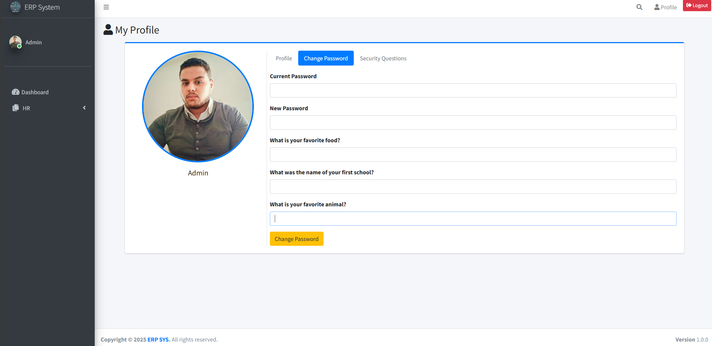

# Frontend Prototype

The frontend is built using **Angular CLI 19** with a modular structure.

## Structure
erp-frontend/  
├── src/  
│   ├── app/  
│   │   ├── core/ → shared services (interceptors, guards, auth)  
│   │   ├── shared/ → shared components (error pages, profile sidebar)  
│   │   ├── features/  
│   │   │   ├── hr/ → HR module  
│   │   │   ├── users/ → Users module  
│   │   │   ├── crm/ → CRM module  
│   │   │   ├── finances/ → Finance module  
│   │   │   └── logging/ → Logging module  
│   │   ├── layout/ → main layout (sidebar, header, footer)  
│   │   └── app.module.ts  
├── assets/  
└── environments/  

## Features
- Login page (authentication).  
- Profile page (photo, personal info, security questions).  
- Employees CRUD (HR module).
- 
  
  
  
  
  
  
  

